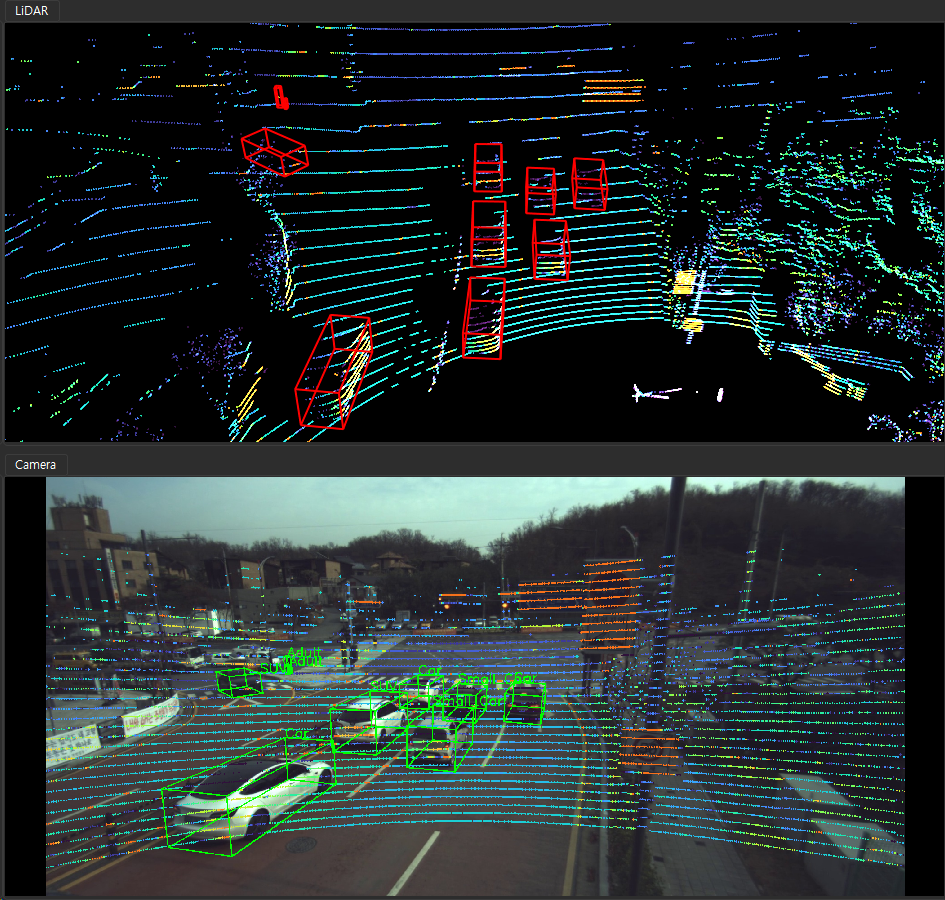
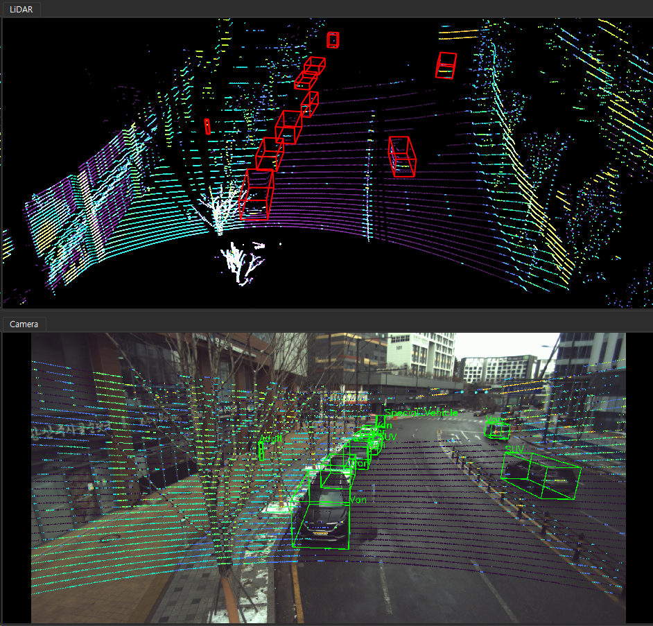
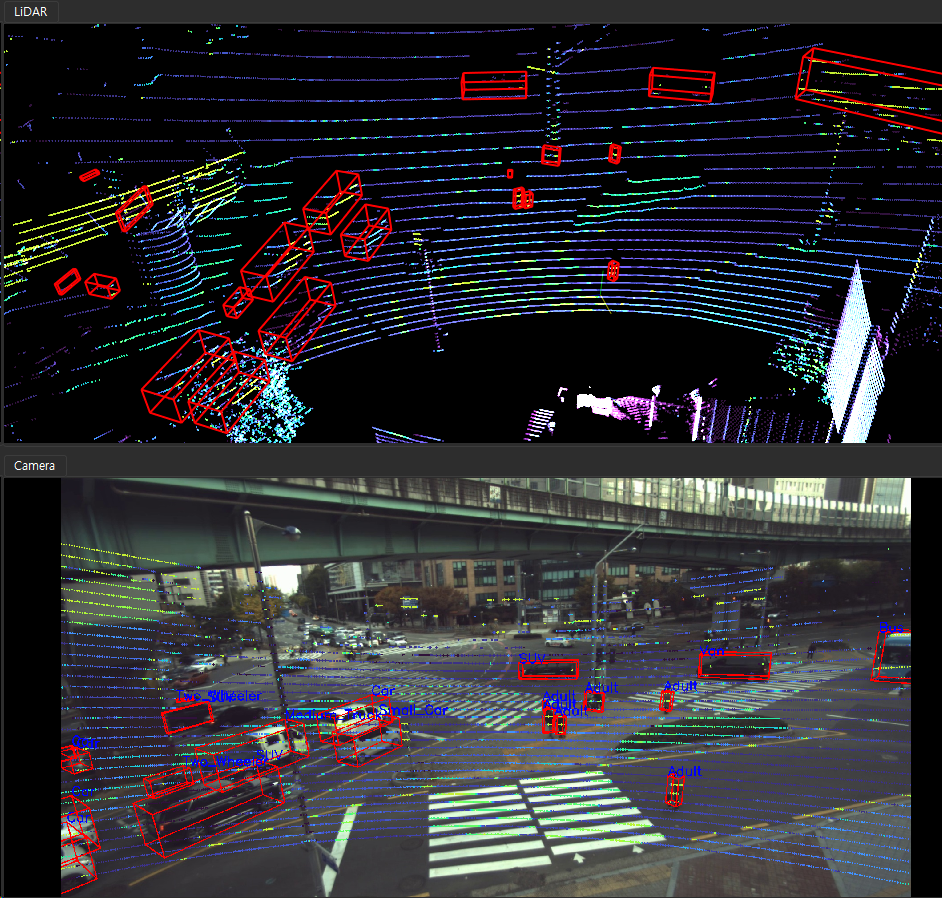
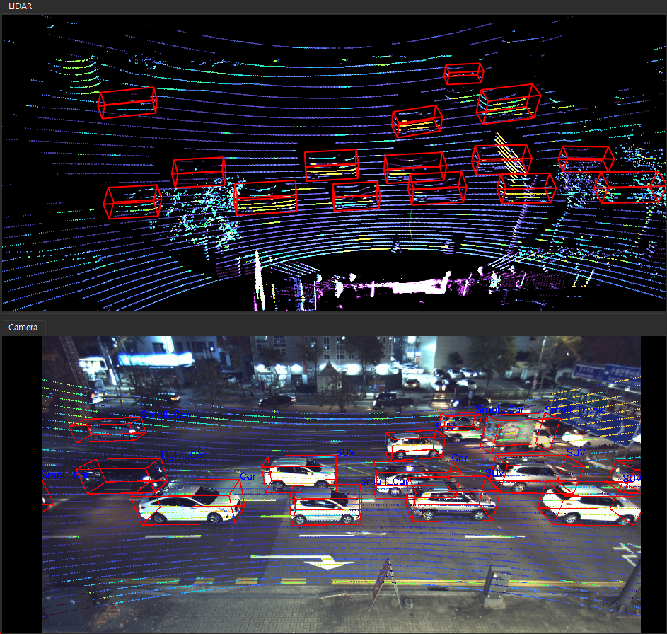

# 지능형 인프라 센서 기반 동적객체 인지 데이터
"지능형 인프라 센서 기반 동적객체 인지 데이터"
https://aihub.or.kr/aihubdata/data/view.do?currMenu=115&topMenu=100&dataSetSn=71609

# Environment
python 3.10.14

opencv
numpy
pyntcloud
open3d

# convert_Infra.py and convert_Vehicle.py

source_root_dir is "Full Dataset (train&val)"

```
dataset (rename "지능형 인프라 센서 기반 동적객체 인지 데이터")
├── dataset (rename "01-1.정식개방데이터")
│   ├── Training
│   │   ├── source (rename "01.원천데이터")
│   │   │   ├── L_2210_Suwon_A_A_C0003
│   │   │   │   ├── sensor_raw_data
│   │   │   │   │   ├── calib
│   │   │   │   │   │   ├── camera
│   │   │   │   │   │   │   ├── xxx.json
│   │   │   │   │   ├── camera
│   │   │   │   │   │   ├── camera_0
│   │   │   │   │   │   │   ├── xxx.jpg
│   │   │   │   │   ├── lidar
│   │   │   │   │   │   ├── xxx.pcd
│   │   ├── label (rename "02.라벨링데이터")
│   │   │   ├── L_2210_Suwon_A_A_C0003
│   │   │   │   ├── sensor_raw_data
│   │   │   │   │   ├── L_2210_Suwon_A_A_C0003.json
│   │   │   │   │   ├── lidar
│   │   │   │   │   │   ├── xxx.json
│   ├── Validation
│   │   ├── source (rename "01.원천데이터")
│   │   │   ├── L_2210_Suwon_A_A_C0003
│   │   │   │   ├── sensor_raw_data
│   │   │   │   │   ├── calib
│   │   │   │   │   │   ├── camera
│   │   │   │   │   │   │   ├── xxx.json
│   │   │   │   │   ├── camera
│   │   │   │   │   │   ├── camera_0
│   │   │   │   │   │   │   ├── xxx.jpg
│   │   │   │   │   ├── lidar
│   │   │   │   │   │   ├── xxx.pcd
│   │   ├── label (rename "02.라벨링데이터")
│   │   │   ├── L_2210_Suwon_A_A_C0003
│   │   │   │   ├── sensor_raw_data
│   │   │   │   │   ├── L_2210_Suwon_A_A_C0003.json
│   │   │   │   │   ├── lidar
│   │   │   │   │   │   ├── xxx.json

```

convert Infrasturcture data to M-Fast/L-Fast Form

```python
python convert.py --source_root_dir "path/to/dataset" --output_root_dir "path/to/output"
```

# Result

## Pangyo_A



## Pangyo_B



## Suwon_A



## Suwon_B

