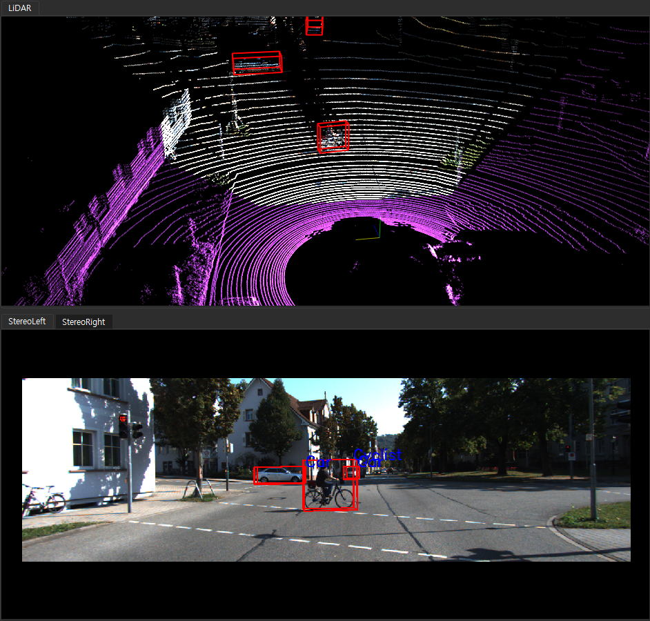
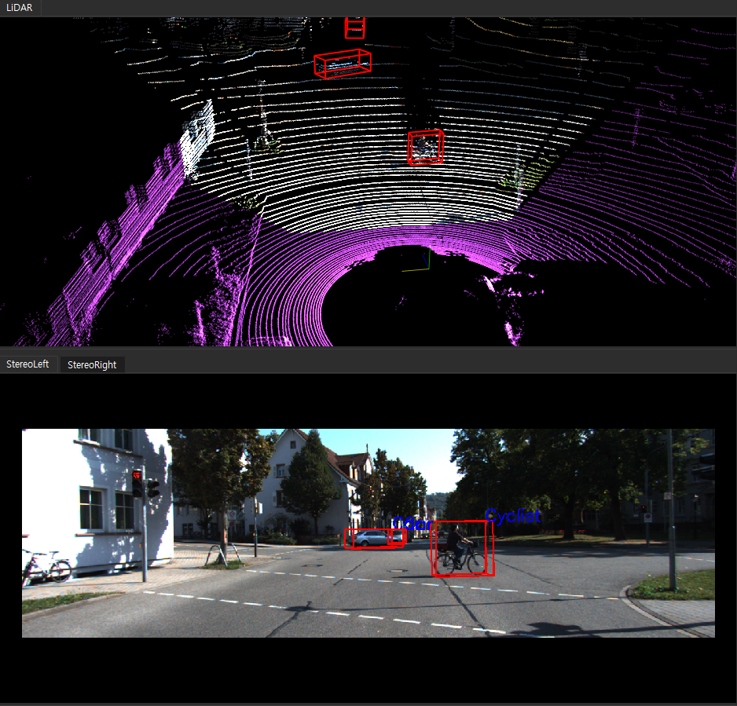
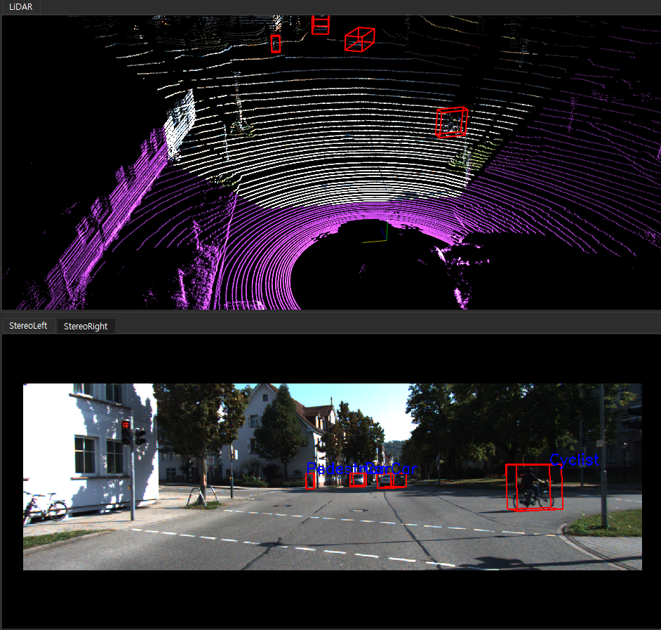
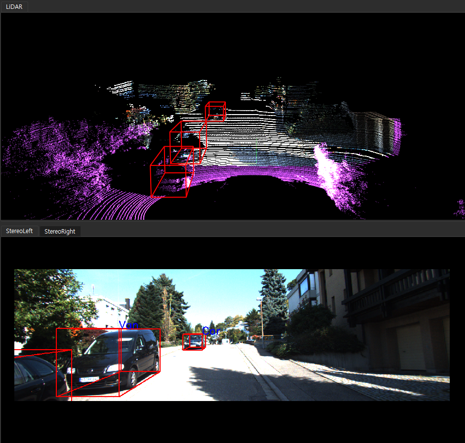
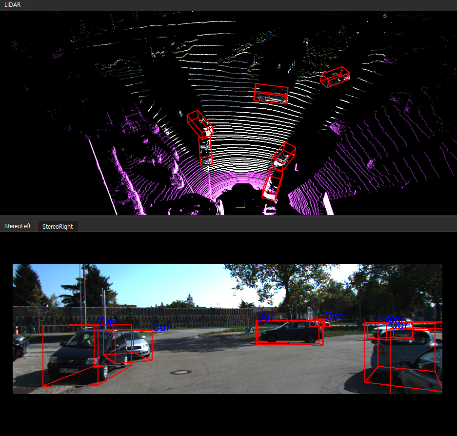
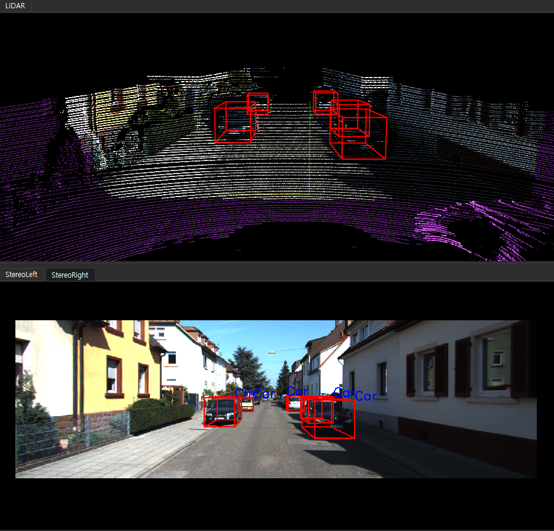

# KITTI

"Are we ready for Autonomous Driving? The KITTI Vision Benchmark Suite"

https://www.cvlibs.net/datasets/kitti/

# Environment
python 3.10.14

opencv

numpy

pyntcloud

open3d

# convert_kitti_raw.py and 

https://www.cvlibs.net/datasets/kitti/raw_data.php

download list

```
2011_09_26_calib.zip
2011_09_26_drive_0001_sync.zip
2011_09_26_drive_0001_tracklets.zip
2011_09_26_drive_0002_sync.zip
2011_09_26_drive_0002_tracklets.zip
2011_09_26_drive_0005_sync.zip
2011_09_26_drive_0005_tracklets.zip
2011_09_26_drive_0009_sync.zip
2011_09_26_drive_0009_tracklets.zip
2011_09_26_drive_0011_sync.zip
2011_09_26_drive_0011_tracklets.zip
2011_09_26_drive_0013_sync.zip
2011_09_26_drive_0013_tracklets.zip
2011_09_26_drive_0014_sync.zip
2011_09_26_drive_0014_tracklets.zip
2011_09_26_drive_0015_sync.zip
2011_09_26_drive_0015_tracklets.zip
2011_09_26_drive_0017_sync.zip
2011_09_26_drive_0017_tracklets.zip
2011_09_26_drive_0018_sync.zip
2011_09_26_drive_0018_tracklets.zip
2011_09_26_drive_0019_sync.zip
2011_09_26_drive_0019_tracklets.zip
2011_09_26_drive_0020_sync.zip
2011_09_26_drive_0020_tracklets.zip
2011_09_26_drive_0022_sync.zip
2011_09_26_drive_0022_tracklets.zip
2011_09_26_drive_0023_sync.zip
2011_09_26_drive_0023_tracklets.zip
2011_09_26_drive_0027_sync.zip
2011_09_26_drive_0027_tracklets.zip
2011_09_26_drive_0028_sync.zip
2011_09_26_drive_0028_tracklets.zip
2011_09_26_drive_0029_sync.zip
2011_09_26_drive_0029_tracklets.zip
2011_09_26_drive_0032_sync.zip
2011_09_26_drive_0032_tracklets.zip
2011_09_26_drive_0035_sync.zip
2011_09_26_drive_0035_tracklets.zip
2011_09_26_drive_0036_sync.zip
2011_09_26_drive_0036_tracklets.zip
2011_09_26_drive_0039_sync.zip
2011_09_26_drive_0039_tracklets.zip
2011_09_26_drive_0046_sync.zip
2011_09_26_drive_0046_tracklets.zip
2011_09_26_drive_0048_sync.zip
2011_09_26_drive_0048_tracklets.zip
2011_09_26_drive_0051_sync.zip
2011_09_26_drive_0051_tracklets.zip
2011_09_26_drive_0052_sync.zip
2011_09_26_drive_0052_tracklets.zip
2011_09_26_drive_0056_sync.zip
2011_09_26_drive_0056_tracklets.zip
2011_09_26_drive_0057_sync.zip
2011_09_26_drive_0057_tracklets.zip
2011_09_26_drive_0059_sync.zip
2011_09_26_drive_0059_tracklets.zip
2011_09_26_drive_0060_sync.zip
2011_09_26_drive_0060_tracklets.zip
2011_09_26_drive_0061_sync.zip
2011_09_26_drive_0061_tracklets.zip
2011_09_26_drive_0064_sync.zip
2011_09_26_drive_0064_tracklets.zip
2011_09_26_drive_0070_sync.zip
2011_09_26_drive_0070_tracklets.zip
2011_09_26_drive_0079_sync.zip
2011_09_26_drive_0079_tracklets.zip
2011_09_26_drive_0084_sync.zip
2011_09_26_drive_0084_tracklets.zip
2011_09_26_drive_0086_sync.zip
2011_09_26_drive_0086_tracklets.zip
2011_09_26_drive_0087_sync.zip
2011_09_26_drive_0087_tracklets.zip
2011_09_26_drive_0091_sync.zip
2011_09_26_drive_0091_tracklets.zip
2011_09_26_drive_0093_sync.zip
2011_09_26_drive_0093_tracklets.zip  << tracklet_labels.xml path is different
```

source_root_dir is "source_dir"

```
source_dir
├── calib
│   ├── calib_cam_to_cam.txt
│   ├── calib_imu_to_velo.txt
│   └── calib_velo_to_cam.txt
├── data
│   ├── 2011_09_26_drive_0001_sync
│   │   ├── image_00
│   │   ├── image_01
│   │   ├── image_02
│   │   ├── image_03
│   │   ├── oxts
│   │   ├── velodyne_points
│   │   └── tracklet_labels.xml
│   ├── ...
│   └── 2011_09_26_drive_0091_sync
```

convert KITTI to M-Fast/L-Fast Form

```python
python convert_kitti_raw.py --source_root_dir "path/to/dataset" --output_root_dir "path/to/output"
```

# convert_kitti_3d_detection.py

https://www.cvlibs.net/datasets/kitti/eval_object.php?obj_benchmark=3d

source_root_dir is "source_dir"

```
source_dir
├── training
│   ├── calib
│   ├── image_2
│   ├── image_3
│   ├── label_2
│   └── velodyne
├── testing (not used)
│   ├── calib
│   ├── image_2
│   ├── image_3
│   └── velodyne
```

convert KITTI_Subset to M-Fast/L-Fast Form

```python
python convert_kitti_3d_detection.py --source_root_dir "path/to/dataset" --output_root_dir "path/to/output"
```

# Results

### KITTI_RAW








### KITTI_3D_Detection





