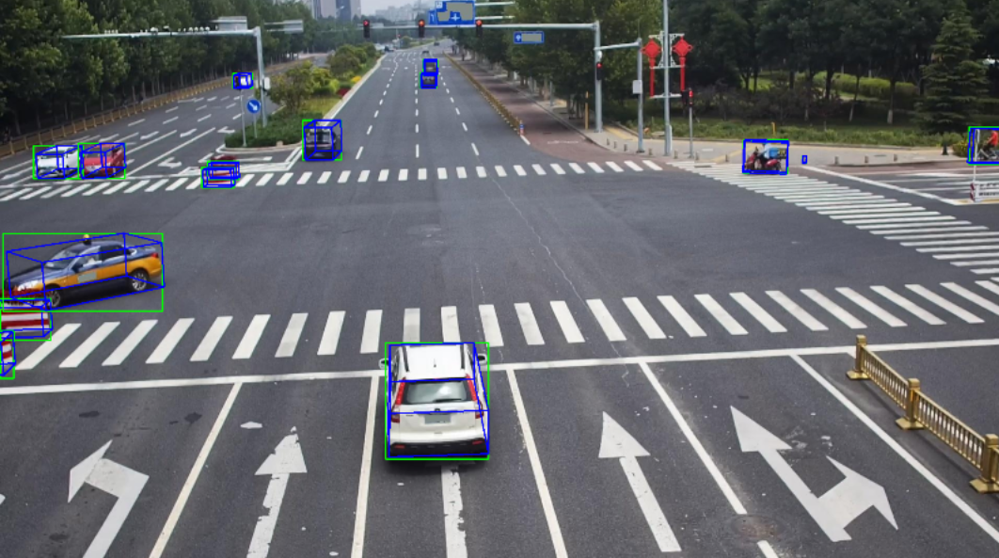
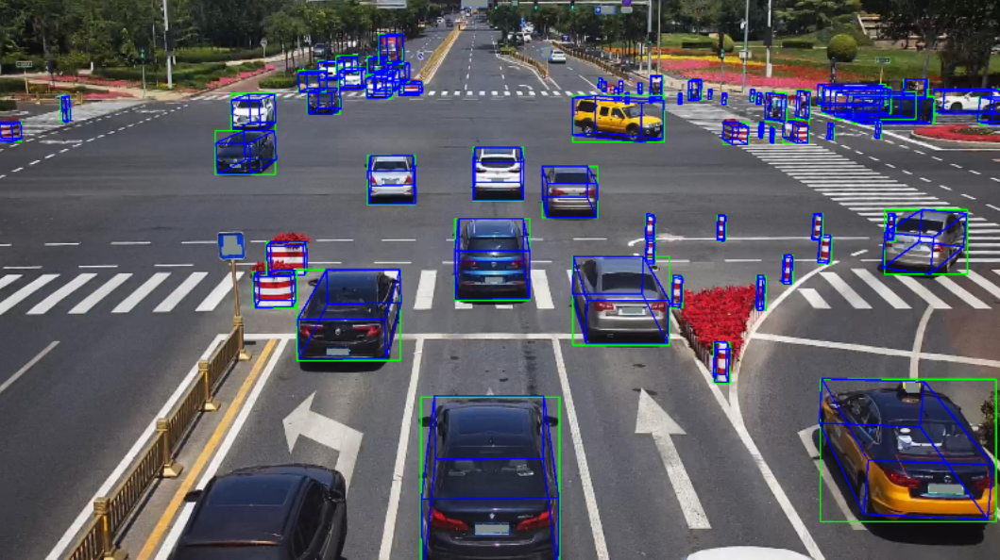
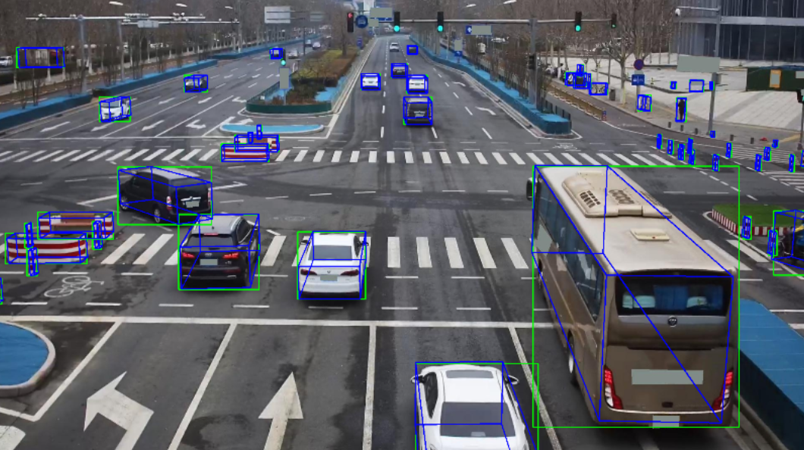

# Rope3D

"Rope3D: TheRoadside Perception Dataset for Autonomous Driving and Monocular 3D Object Detection Task"

https://thudair.baai.ac.cn/rope

# Environment
python 3.10.14

opencv

numpy

pyntcloud

open3d

# parse_Rope3dToOurs.py

source_root_dir is "Rope3D_data"

```
Rope3D_data
├── label_2_4cls_for_train
├── label_2_4cls_filter_with_roi_for_eval
├── label_2
├── ImageSets
├── image_2
├── extrinsics
├── denorm
├── calib
├── box3d_depth_dense

```

convert Rope3D to M-Fast/L-Fast Form

```python
python convert.py --source_root_dir "path/to/dataset" --output_root_dir "path/to/output"
```

# Result






