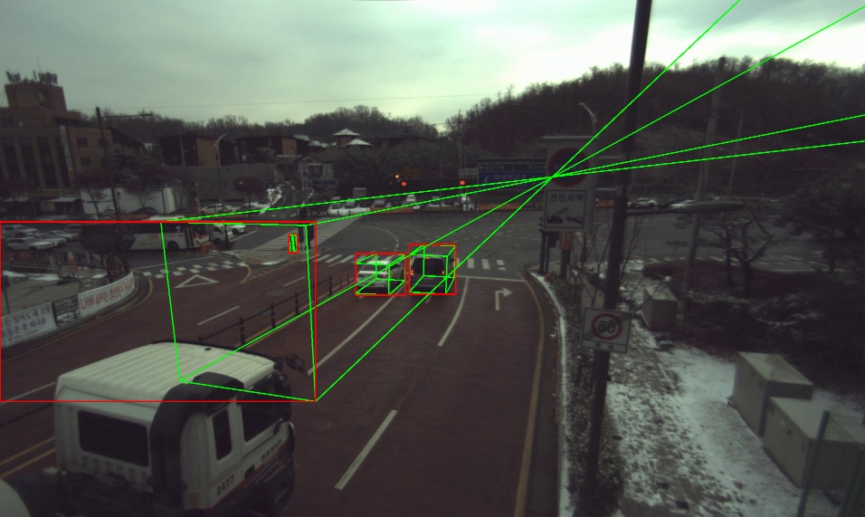
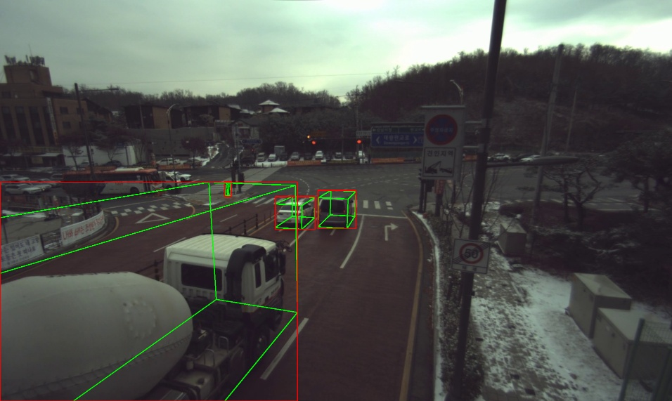
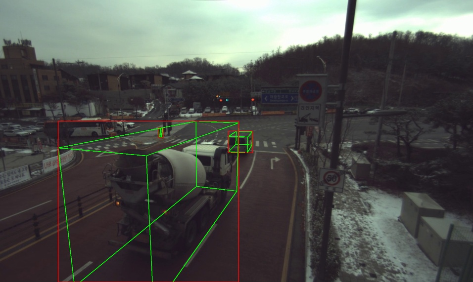
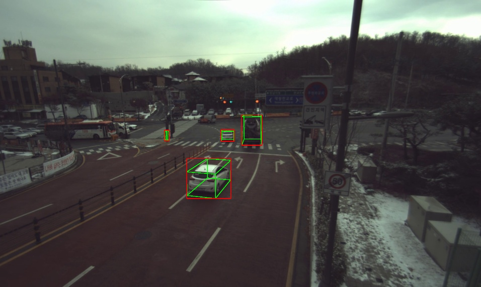
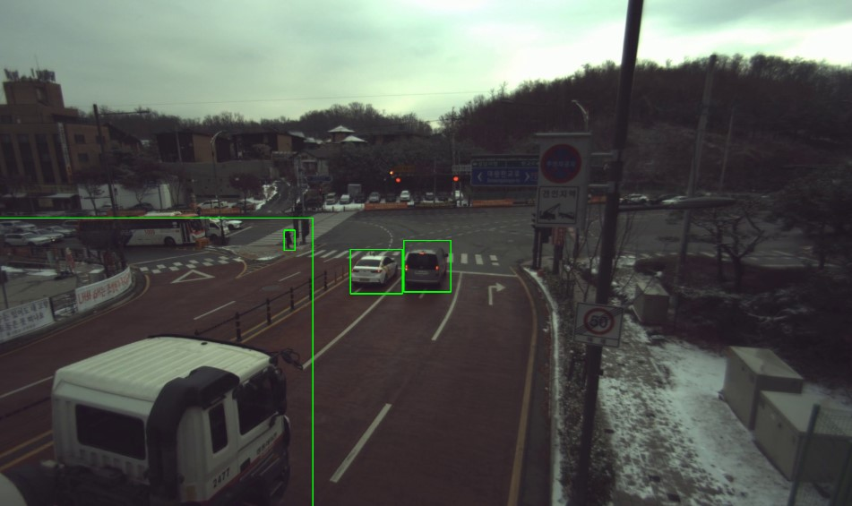

# Generator_2DBox

## Usage

Generate 2D Box from 3D Box

main.py -> Using projected 8 points
main2.py -> Using 3D Box Rasterization

```python
python main.py --root_dir "path/to/dataset"
```

```
root_dir
├── Train
├── Valid
```

## Result (main.py)



Z < 0 and projected other side of the image







## Result (main2.py)

